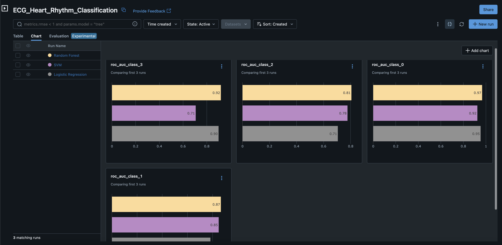

# ECG Heart Rhythm Classification 🫀📈

## Project Overview 🌟
This project is designed to leverage machine learning for the classification of heart rhythms from electrocardiogram (ECG) data, with an emphasis on identifying Atrial Fibrillation, normal rhythms, other arrhythmias, and noisy signals. It incorporates advanced data processing and machine learning techniques to enhance the accuracy of ECG analysis.

## Dataset Description 📊📋
The dataset consists of single-lead ECG recordings, each provided in MATLAB V4 WFDB-compatible format. This includes `.mat` files containing the ECG signal data and `.hea` files with header information detailing the waveform properties.

## Objectives 🎯
- To develop accurate machine learning models capable of classifying various heart rhythms from ECG data.
- To refine feature extraction processes that efficiently capture the diagnostic characteristics of ECG signals.
- To improve the automation of ECG data analysis, facilitating prompt and precise detection of cardiac anomalies.

## Methodology 🔬📝
- **Data Preprocessing**: Standardize and clean ECG signals to prepare them for analysis.
- **Feature Extraction**: Employ feature extraction techniques to distill critical information from the ECG signals.
- **Model Development and Comparison**: Construct, train, and compare various machine learning models, including Logistic Regression, SVM, and Random Forest, to determine the most effective approach.
- **Performance Evaluation**: Utilize metrics such as accuracy and the area under the ROC curve to evaluate and compare model performances.

## MLflow Integration 🚀🔍
- **Experiment Tracking**: Implement MLflow for tracking experiments, recording parameters, and metrics to streamline the model development process.
- **Model Management**: Use MLflow for model versioning, representing the development lifecycle of each machine learning model.
- **Model Serving**: Facilitate the deployment of the best-performing models using MLflow's model serving capabilities, allowing for real-time ECG classification.
- **Results Reproducibility**: Ensure that experiments are reproducible, with MLflow tracking allowing for the exact replication of results and model performance.

## Model Performance Comparison 📊📉

The following bar charts represent the ROC AUC scores for each class across three different models: Random Forest, SVM, and Logistic Regression. These metrics were tracked and visualized using MLflow, which enabled us to compare the model performances side-by-side effectively.

The charts provide a clear visual indication of which models perform best for each specific class of heart rhythm, thereby guiding the selection of the most suitable model for deployment.

## Getting Started 🚀🔧
To run this project, ensure you have the following prerequisites installed:
- Python 3.8 or higher
- Necessary Python libraries as specified in `requirements.txt`
- MLflow running on the local server or set up on a cloud provider
